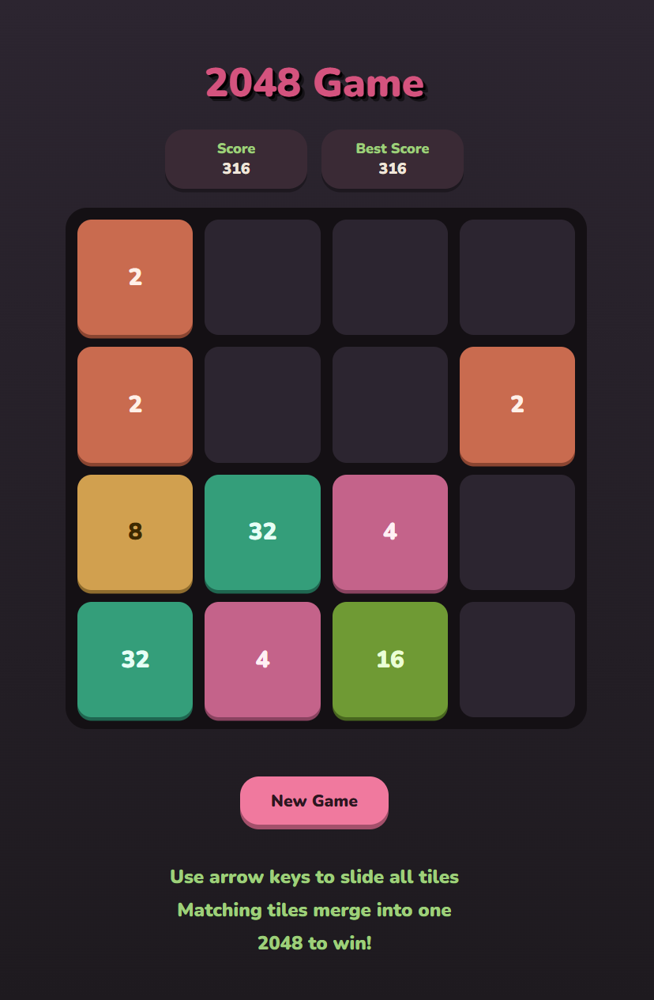
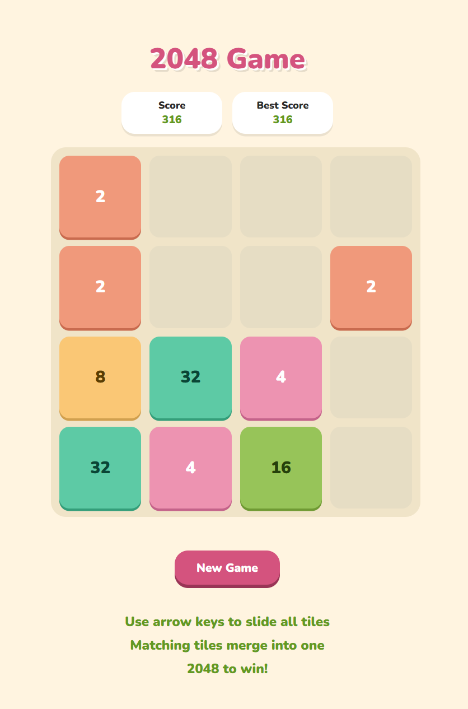
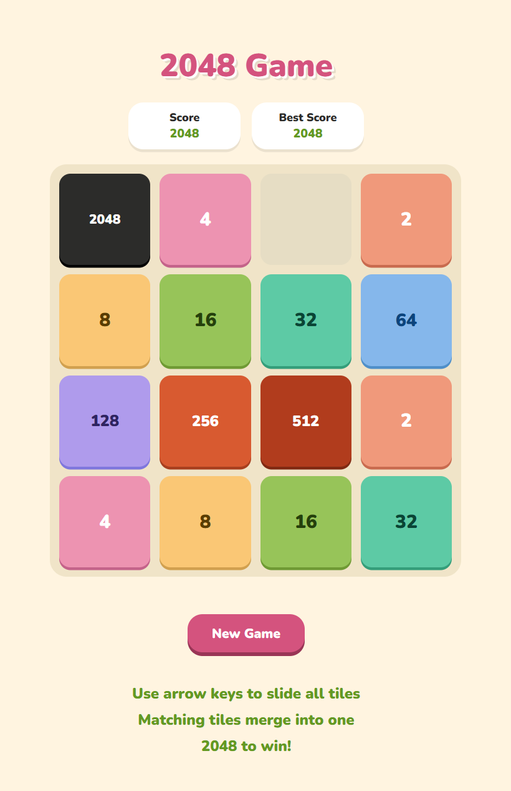
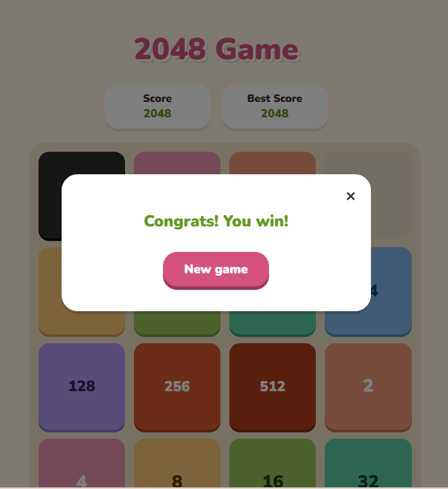
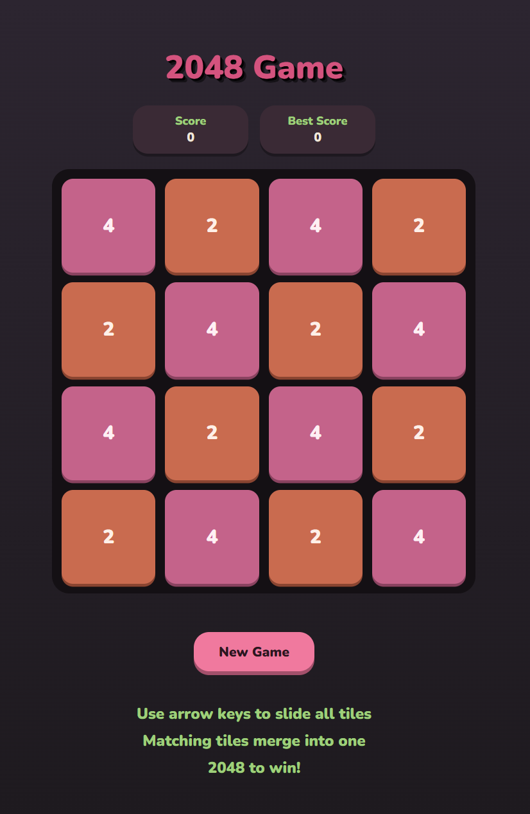
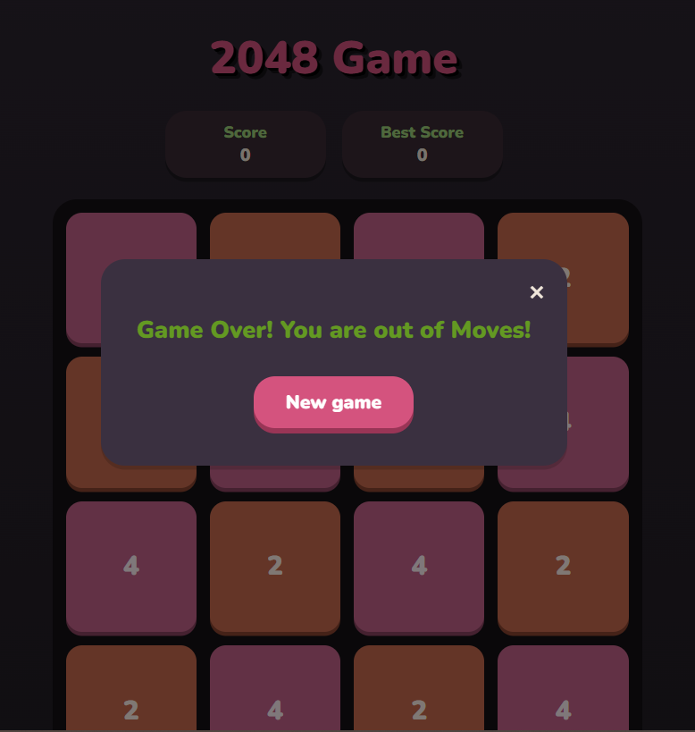

# 2048 Game

A custom-built version of the classic **2048 puzzle game**, developed from scratch using **HTML, CSS, and JavaScript**.

The goal is simple: combine matching tiles to create higher numbers and reach the legendary **2048 tile**.

---

## Live Demo

🔗 [Play the Game](https://FatimaHubail.github.io/2048-game/)

---

## Screenshots

<p align="center">
  <br>
  <em>Dark mode board mid-game, showing merged tiles and the score panel.</em>
</p>

<p align="center">
  <br>
  <em>Light mode board mid-game.</em>
</p>

<p align="center">
  <br>
  <em>The board after reaching the 2048 tile — the win condition triggers as soon as a merge produces this value.</em>
</p>

<p align="center">
  <br>
  <em>The win popup, shown immediately after the 2048 tile is created, with an option to close it or start a new game.</em>
</p>

<p align="center">
  <br>
  <em>A full board with no matching adjacent tiles in any direction and no legal moves remain, triggering the game-over state.</em>
</p>

<p align="center">
  <br>
  <em>The game-over popup, shown once no more moves are possible, with an option to close it or restart.</em>
</p>

---

# Features

## Core Gameplay

- Classic 4x4 2048 grid system
- Arrow-key controls
- Random tile generation:
  - 90% chance for a `2`
  - 10% chance for a `4`
- Tile movement and merging logic
- Dynamic score tracking
- Best score tracking
- Win detection
- Game-over detection

---

## User Interface

- Custom pastel-inspired design
- Responsive layout for different screen sizes
- Animated tile appearance
- Custom tile colors for different values
- Dark mode support based on system preference
- Win and game-over modal messages
- Interactive buttons with hover and click effects

---

## Special Features

- Reusable movement algorithm for all directions
- Smooth tile animations
- Smart move detection (new tiles only appear after valid moves)

---

#  How to Play

1. Use the arrow keys to move tiles:

| Key | Action |
|---|---|
| ⬆️ Arrow Up | Move tiles upward |
| ⬇️ Arrow Down | Move tiles downward |
| ⬅️ Arrow Left | Move tiles left |
| ➡️ Arrow Right | Move tiles right |

2. Tiles with the same number merge together.

Example:

```
2 + 2 = 4

4 + 4 = 8
```

3. Continue merging tiles until you reach:

```
2048 🎉
```

---

#  Technologies Used

- HTML5
- CSS3
- JavaScript (ES6)

## Concepts Practiced

- DOM manipulation
- Event handling
- JavaScript arrays
- Two-dimensional data structures
- Game state management
- Algorithm design
- Conditional logic
- CSS animations
- Responsive web design

---

# How It Works

The game board is represented using a JavaScript **2D array**.

Example:

```javascript
[
    [2, null, 4, null],
    [null, 8, null, 2],
    [null, null, 4, null],
    [2, null, null, null]
]
```

- `null` represents an empty cell.
- Numbers represent existing tiles.

The game follows this flow:

```
User Input
     ↓
Detect Direction
     ↓
Move Tiles
     ↓
Merge Matching Tiles
     ↓
Update Score
     ↓
Generate New Tile
     ↓
Render Updated Board
```

---

# Main Technical Challenges

## 1. Creating a Reusable Movement System

The biggest challenge was handling four different directions:

- Left
- Right
- Up
- Down

Instead of writing separate logic for each direction, a reusable movement function was created.

The same merge algorithm is used by:
- Moving normally
- Reversing rows or columns when needed

This reduced duplicated code and made the game easier to maintain.

---

## 2. Handling Tile Merging

Tiles must merge correctly while preventing multiple merges in one move.

Example:

```
[2, 2, 2, 2]
```

becomes:

```
[4, 4, null, null]
```

The merge process:

1. Remove empty cells
2. Check adjacent matching values
3. Combine matching tiles
4. Add empty cells back

---

## 3. Detecting Valid Moves

A new tile should only appear when the player makes a successful move.

To achieve this:

- The board state is saved before the move.
- The board is compared after the move.
- A new tile is generated only if the board changed.

This prevents unwanted tile generation when the player presses a direction that cannot move anything.

---

# Project Structure

```
2048-game/
│
├── index.html
│
├── css/
│   └── style.css
│
├── js/
│   └── app.js
│
└── README.md
```

---

# Developer

Created by **Fatima Hubail**

Developed as part of my **General Assembly Software Engineering training**.

---

# Acknowledgments

Inspired by the original **2048 game** created by Gabriele Cirulli.
